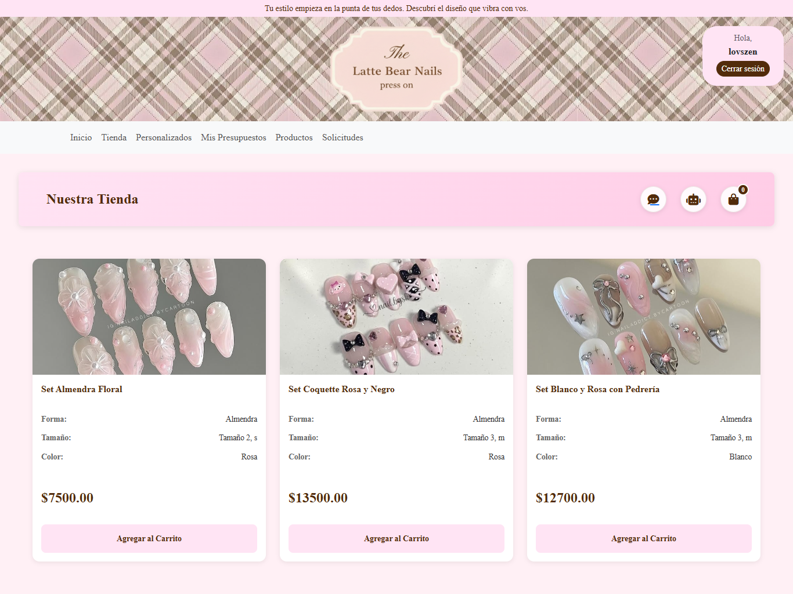
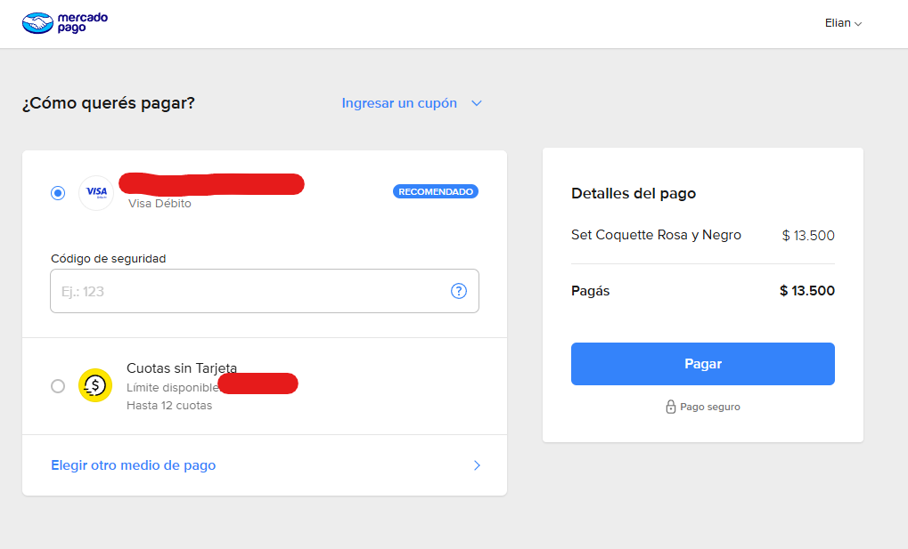
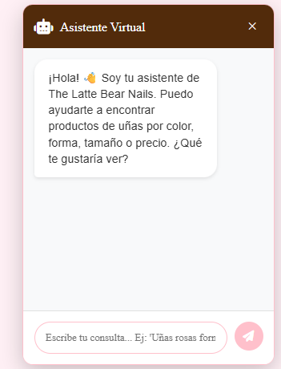
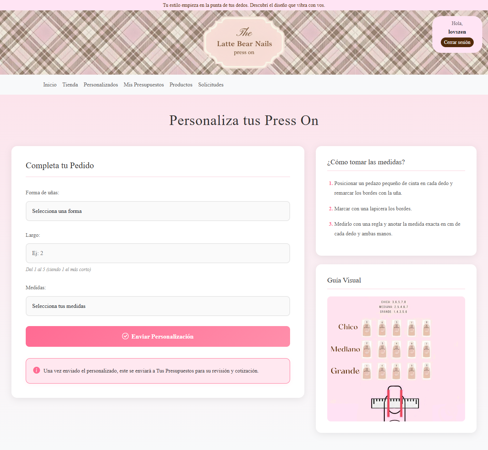
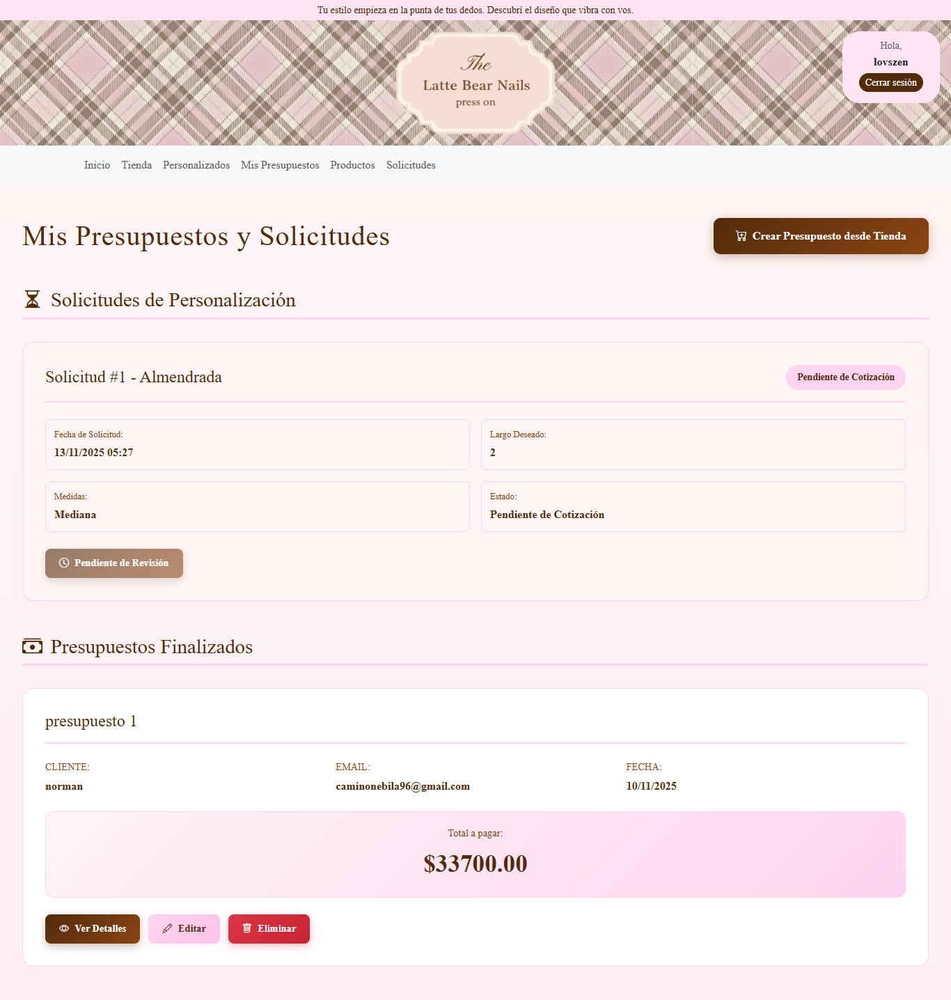
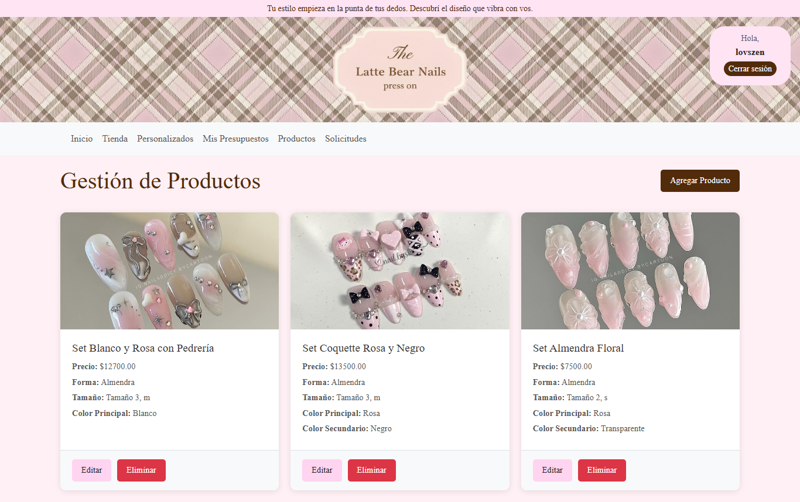
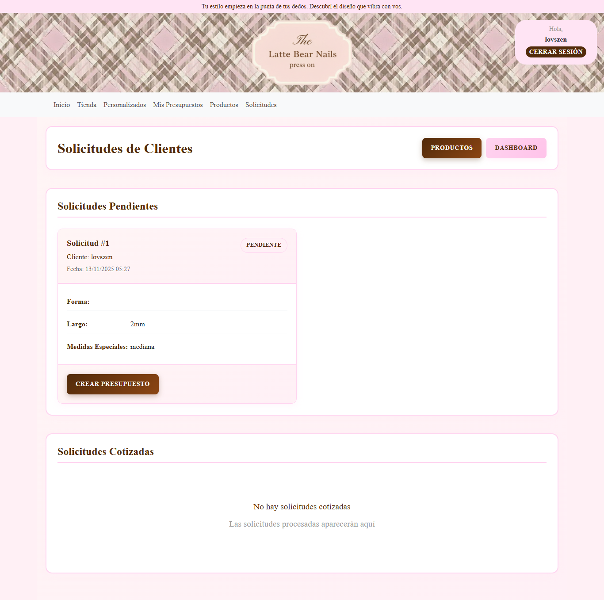
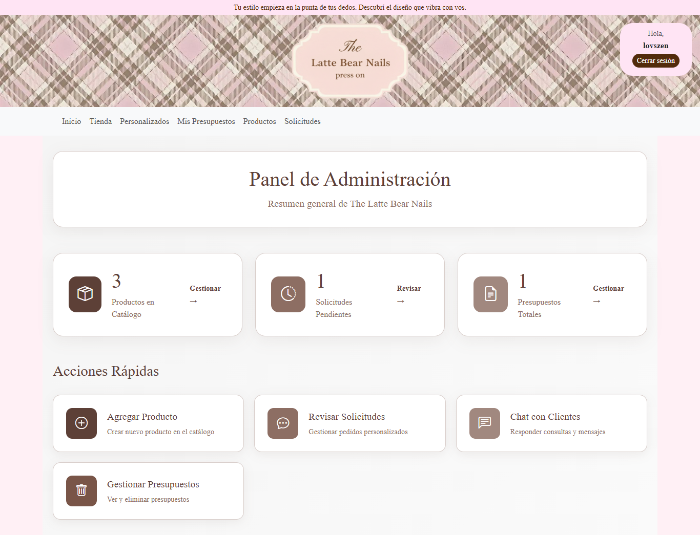

# The Latte Bear Nails

Marketplace Local de productos de uñas "press on" con integración de pagos y chat.

# Contexto sobre el desarrollo

Este proyecto fue desarrollado como trabajo en equipo durante mi formación universitaria.
Lideré el desarrollo frontend y de interfaces en este proyecto colaborativo.

# Mis colaboraciones

# Diseño y desarrollo de frontend completo.

Rediseñé todas las interfaces desde cero

Creé una landing page atractiva con autenticación social

Desarrollé la tienda online completa con catálogo y carrito

Implementé el sistema de uñas personalizadas con guías de medidas

Mejoré la interfaz del chat existente

# Sistema de Administración

Desarrollé un panel administrativo exclusivo con permisos

Implementé un gestor completo de productos

Creé un sistema de cotizaciones manuales para personalizados

Diseñé un dashboard con métricas y accesos rápidos

# Extras

Integré Cloudinary para gestión de imágenes

Desarrollé un chat bot básico con interfaz personalizada

Contribuí en la gestión de presupuestos del panel admin

# Funcionalidades Clave

Autenticación Social: Login con Google usando django-allauth.

Integración de Pagos: Checkout Pro con MercadoPago.

Pedidos Personalizados: Lógica de chat con WebSockets (Django Channels).

Generación de Presupuestos: Creación de PDFs y envío por email (ReportLab).

# Vistas Principales

Página de la Tienda 

Carrito + proceso de Pago

Chat soporte y chat bot

Panel para personalización
 

Panel presupuestos del cliente

Panel gestor de productos para administradores

Panel gestor de solicitudes para administradores

Dashboard para administradores

# Instalación Local

Para correr el proyecto, necesitas Python 3.11+.

Clona el repositorio:

git clone https://github.com/lovszen/the-latte-bear-nails.git
cd the-latte-bear-nails

Crea y activa el entorno virtual:

python -m venv venv
.\venv\Scripts\activate

Instala las dependencias:

pip install -r requirements.txt
python manage.py makemigrations
python manage.py migrate

correr el server:

python manage.py runserver

chat admin:

http://127.0.0.1:8000/admin_chat/