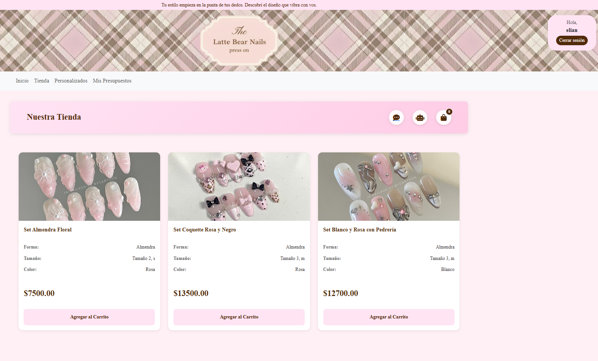

# The Latte Bear Nails 🧸💅

Marketplace Local de productos de belleza y uñas "press on" con integración de pagos y chat.

# Funcionalidades Clave

Autenticación Social: Login con Google usando django-allauth.

Integración de Pagos: Checkout Pro con MercadoPago.

Pedidos Personalizados: Lógica de chat con WebSockets (Django Channels).

Generación de Presupuestos: Creación de PDFs y envío por email (ReportLab).

# Vistas Principales

Página de la Tienda 

Carrito + proceso de Pago

Chat soporte y chat bot

# Instalación Local

Para correr el proyecto, necesitas Python 3.11+.

Clona el repositorio:

git clone https://github.com/genuxl/the-latte-bear-nails.git

cd the-latte-bear-nails

Crea y activa el entorno virtual:

python -m venv venv
.\venv\Scripts\activate

Instala las dependencias:

pip install -r requirements.txt
python manage.py makemigrations
python manage.py migrate

correr el server:

python manage.py runserver

chat admin:

http://127.0.0.1:8000/admin_chat/